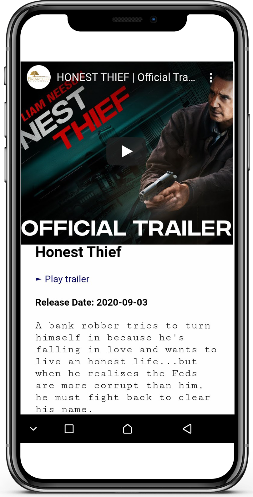
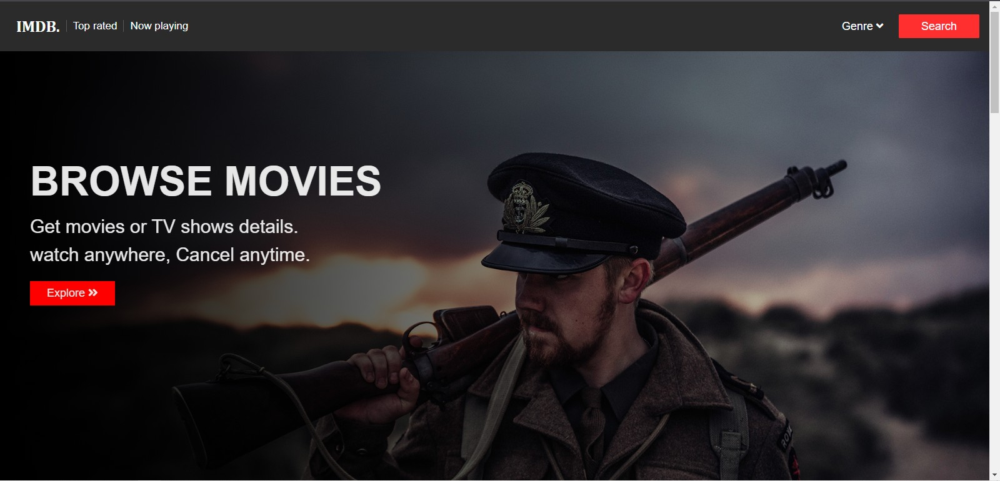

# Movie-search-app


### Description:
A web app that allows users to access movies details on search  and by categories. Users also have the option of watching the movie trailer before exiting the app.

### Technology stack:
* HTML5
* CSS3
* Javascript(Vanillajs)

### Status & Purpose:
A completed hosted personal project of me. it was developed to allow easy  access to movie details before watching


### Image: 
   |   
 
 


### live preview:  
https://moviesearchproject.netlify.app/

### Setup:
1. Copy the repository link 
2. On your commandline/terminal, change the current working directory to the location where you want the cloned directory.
3. Type ``` git clone https://github.com/USER_NME/REPOSITORY_NAME```.(make sure the link is the link to the repository)
4. press enter to create your local clone.

### Reqirement & Resources for development: 
 * Any IDE (VSCode, Bracket, Atom, Sublime e.t.c)
 * Basic knowledge in HTML, CSS and Javascript
 * Knowledge in fetching and displaying form of  data from a remote API 
 #### API USED: 
 IMDb API. 
 check how to use [HERE](https://rapidapi.com/blog/how-to-use-imdb-api/)
